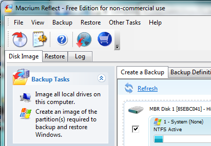
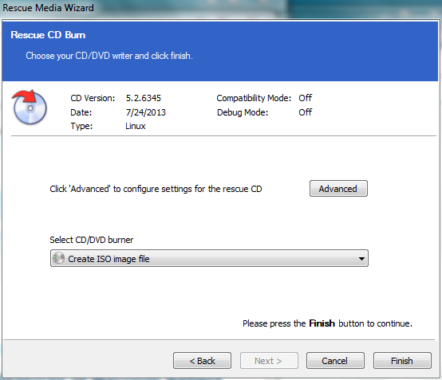
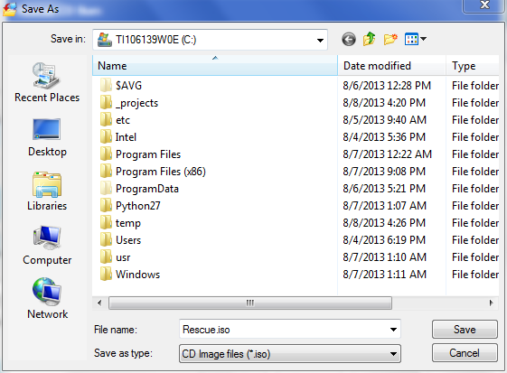
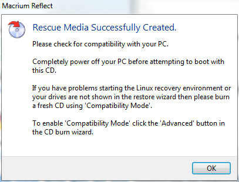
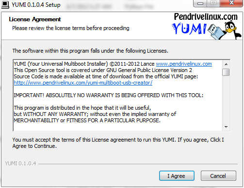
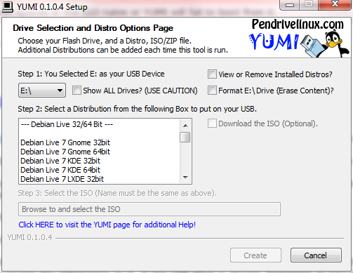
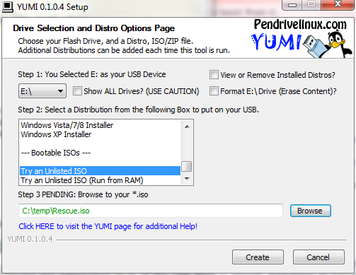
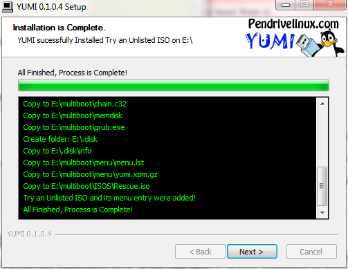
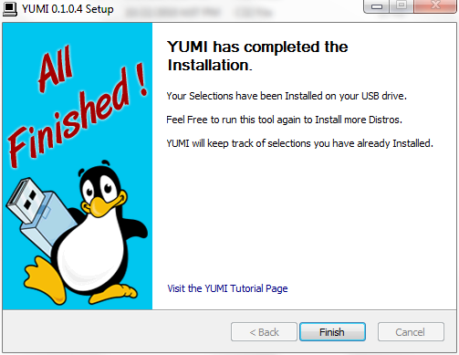

################################
Creating a recovery USB for Win7
################################

..	seealso::

	`Create Bootable Rescue USB Drive <http://www.sevenforums.com/tutorials/218920-macrium-reflect-create-bootable-rescue-usb-drive.html>`_

If you work on a particular computer system a lot, eventually you will feel
that you need to restore that system to a known stable state. Usually this
occurs after installing and removing programs you want to try out, only to
discover they do not work well and you want to remove them. On Windows this
seems much more difficult to do than it should.

So, what this all means is that we start off backing up our data and
reinstalling the base operating system and all the applications you really
need. This can be a painful process that consumes a lot of your time.
Fortunately, there is a better way to manage your system.

Basically, this better way involves capturing the state of the machine when it
is first brought to life (and scrubbed of any "junkware" you do not need). This
image has no user programs beyond those that keep the machine healthy (like
anti-virus software, for instance). When the system is in a state you like, we
capture a snapshot of that configuration and set up rescue media that can
be used to quickly restore the machine to that state.

With that step completed, we will set up automated tools to add the additional
software you need to complete your setup. As much as possible, this automation
will require no user interaction, and will install the most recent versions of
the tools you decide to use. 

My current Windows 7 systems can be rebuilt in about 30 minutes using this
approach. This note details the steps I took to create this management system.

..  note::

    As much as possible I use open-source tools for my work. My students often
    do not have the financial resources to purchase expensive programs for
    their systems, so this management scheme focuses on installing tools we
    download from the Internet. Commercial software can be added as needed, but
    that process is not covered here.

Imaging a Windows PC
********************

Each Windows machine needs to have a properly licensed copy of Windows
installed. (ideally, you record this license number somewhere just in case you
need it at a later time.) Often this copy came pre-installed on the machine,
and the owner does not have CD or DVD copies of the software. Many of today's
systems come with a special recovery partition containing software that can
restore the system to the "as delivered" state. You may also have a way to copy
this special partition to a set of DVDs, but that may take a lot of them (seven
on an HP system I bought some time back). I like to be able to restore my
development systems with a minimum of fuss, and sitting around for several
hours loading DVDs as they are requested is not an acceptable way of life for
me!

So, I want to use a bootable USB flash drive to do my restore. For Windows, I
use a 32BG flash drive purchased for around $20. Obviously, this drive is not
big enough to image a fully loaded machine, so I focus on a stable starting
point image first.

In this note, we will build a recovery USB flash drive suitable for restoring
my Toshiba Satellite L755 system, which was purchased for around $400 and
delivered with Windows 7 Home Premium edition. This machine is typical of those
my students use in my classes.

***************
Getting started
***************

To start this setup, you need to download and install two free packages:

* `Macrium Reflect <http://www.macrium.com/reflectfree.aspx>`_
* `Yumi Multiboot USB Creator <http://www.pendrivelinux.com/yumi-multiboot-usb-creator/>`_

Start up Macrium Reflect
========================

Open the Macrium Reflect tool:

Select :menuselection:`Other Tasks --> Create Rescue Media`:

On this screen, click on the :menuselection:`Select CD/DVD burner` drop-down
list and select :menuselection:`Create ISO image file`. Click on
:menuselection:`Finish` to create the iso.

When you finish, your iso file is available for the next step.

Installing Yumi
===============

To start this step, plug in an empty USB drive (with no other drives
installed).  Note the drive letter assigned by Windows. Start the Yumi program
and allow administrator access. You will be asked for the drive letter of the
USB device you want to set up.

Your first step is to agree to the license:

Once you agree to the license, you will see this screen:

In the :menuselection:`Distribution` box, scroll to the bottom and select
:menuselection:`Try an unlisted ISO`. Browse to the iso created in the previous
step:

When you click on "Continue" you are asked to confirm the settings:

Yumi will create the bootable drive and copy the ISO to it. When it is done,
you should see this:

You could add additional iso images if there is room. Click on
:menuselection:`Finish` to get to this final screen:

Testing the rescue USB
**********************

The acid test of this process involves trying a recovery. In my case, I have
another image available, so this is not as risky as it might be otherwise. 

With the USB in place restart the machine and hold down the F12 key. When the
boot menu appears, select the USB device.

